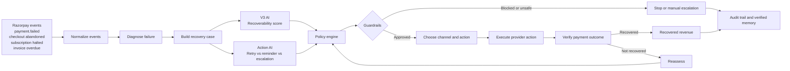
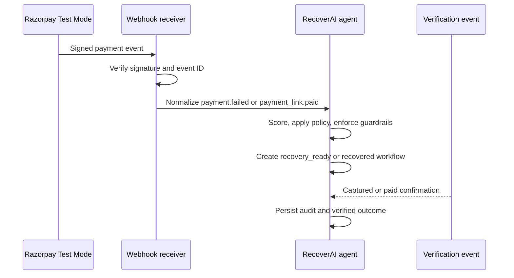

# RecoverAI

RecoverAI is a controlled AI revenue-recovery agent built for Razorpay Buildathon Track 03, **AI Revenue Recovery**.

When money is at risk, the problem is rarely just "retry the payment". A customer may have insufficient funds, a payment rail may time out, a checkout may be abandoned, a subscription may halt, or a risk decision may make a retry unsafe. RecoverAI turns those signals into a recovery case, chooses the next safe intervention, verifies the result, and escalates when automation should stop.

## What The Project Does

RecoverAI brings payment failures, failed subscriptions, abandoned checkouts, and overdue invoices into one workflow:

```text
revenue-risk event
  -> normalized event and failure diagnosis
  -> deduplicated recovery case
  -> ML recoverability and action scoring
  -> policy and consent guardrails
  -> bounded execution
  -> provider verification
  -> recovered, stopped, or escalated
```

The system is autonomous within clear boundaries. ML recommends; policy defines the safe sequence; guardrails authorize or block; the provider executes; and a verified event confirms recovery. No model can retry a risk decline, contact an opted-out customer, exceed the attempt budget, or mark a payment recovered without confirmation.

## The AI And The Rules

There are two complementary model signals:

- The V3 case-level model estimates whether a revenue-risk case is recoverable.
- The action-conditioned recommender compares retry, reminder, and escalation for the current case context.

The action recommender is trained on the synthetic benchmark's action rows. It is a prototype ranking signal, not a production-trained policy. This is intentional: a payment model should not be allowed to override consent, risk, retry limits, or merchant policy.

## Measured Result

The checked-in evaluation uses 3,262 isolated unseen cases. It compares RecoverAI with a one-retry baseline on the same population:

| Strategy | Recovery rate | Recovered amount |
| --- | ---: | ---: |
| RecoverAI | 51.93% | INR 44,315,137.44 |
| One-retry baseline | 35.84% | INR 30,996,494.37 |
| Difference | +15.82 percentage points | INR 13,318,643.07 |

RecoverAI recovered 1,694 cases versus 1,169 for the baseline. Its run also recorded 4,092 automated attempts, 1,480 escalations, and 88 stopped cases.

These amounts are **deterministic simulated benchmark outcomes**, not real customer revenue. The simulation makes strategy comparisons reproducible; production recovery would be confirmed by Razorpay payment and settlement events.

## Razorpay Test Mode Integration

The project includes a working Test Mode provider boundary:

```text
Razorpay Test Mode event
  -> signed HTTPS webhook
  -> signature verification
  -> duplicate-event protection
  -> RecoverAI normalization
  -> recovery workflow decision
```

Supported events include `payment.failed`, `payment.authorized`, `payment.captured`, `payment_link.paid`, `payment_link.expired`, `subscription.halted`, `invoice.expired`, and `order.paid`.

The receiver stores normalized events in `data/processed/razorpay_webhook_events.jsonl` and workflow results in `data/processed/razorpay_recovery_workflow.jsonl`. A failed payment becomes `recovery_ready` with a policy-selected next action. A captured, authorized, or paid event becomes a verified `recovered` update.

Test Mode webhook delivery was validated with successful HTTP 200 responses. Test Mode is used deliberately: it does not process real customer money. The optional live Payment Link client is isolated behind credentials, consent, callback, timeout, idempotency, and settlement-verification controls.

## Run It Locally

The repository contains generated raw data, unseen data, trained model artifacts, and processed evaluation outputs, so the dashboard can be run without access to private merchant data.

### Install

Python 3.11 or newer is recommended.

```powershell
git clone https://github.com/GHARSHASANDEEP/recoverAI.git
cd recoverAI
python -m venv .venv
.\.venv\Scripts\Activate.ps1
python -m pip install -r requirements.txt
```

On macOS or Linux:

```bash
python3 -m venv .venv
source .venv/bin/activate
python -m pip install -r requirements.txt
```

### Run Tests

```powershell
.\.venv\Scripts\python.exe -m pytest -q
.\.venv\Scripts\python.exe -m compileall -q app.py src
```

The current suite contains 65 tests covering policy, guardrails, state transitions, unseen-data joins, action scoring, channels, memory, webhook signatures, idempotency, and Razorpay event payloads.

### Run The Dashboard

```powershell
.\.venv\Scripts\python.exe -m streamlit run app.py
```

Open `http://localhost:8501`. Judge Mode demonstrates a successful temporary bank-failure recovery, action comparison, state path, verification, audit trail, and a blocked `risk_decline` retry.

### Regenerate The Unseen Evaluation

```powershell
.\.venv\Scripts\python.exe -m src.data.unseen_generator
.\.venv\Scripts\python.exe -m src.engine.unseen_case_builder
.\.venv\Scripts\python.exe -m src.engine.unseen_erv_batch
.\.venv\Scripts\python.exe -m src.engine.unseen_decision_batch
.\.venv\Scripts\python.exe -m src.engine.unseen_agent_batch
.\.venv\Scripts\python.exe -m src.engine.unseen_baseline_batch
```

### Run The Test Webhook Receiver

The Streamlit dashboard is separate from the webhook receiver. To test a Razorpay Test Mode webhook, set the secret in the terminal without putting it in source control:

```powershell
.\run_webhook.ps1 -WebhookSecret "YOUR_RAZORPAY_WEBHOOK_SECRET"
```

The receiver listens on `http://127.0.0.1:8000`. Its routes are:

```text
GET  /health
POST /webhooks/razorpay
```

For Razorpay to reach a local receiver, expose port 8000 through an authenticated HTTPS tunnel. Register the tunnel URL plus `/webhooks/razorpay` in Razorpay Test Mode. The tunnel URL is temporary and only works while the receiver and tunnel processes are running.

## System Flow

This is the architecture graph to use in the pitch and demo:



The real-time Razorpay path is:



The batch evaluation path uses the same decision logic on an isolated unseen
population and compares the agent with a one-retry baseline.

The held-out submission path uses separate unseen inputs:

```text
unseen_generator
  -> unseen_case_builder
  -> unseen_erv_batch
  -> unseen_decision_batch
  -> unseen_agent_batch
  -> unseen_baseline_batch
  -> data/unseen/processed/*.csv
```

The live Test Mode event path is independent of the batch benchmark:

```text
Razorpay webhook
  -> raw-body signature verification
  -> provider event-ID idempotency
  -> event normalization
  -> recovery_ready or recovered workflow
  -> persisted event and workflow records
```

## Safety And Failure Handling

Examples of the recovery policy:

| Failure | First response | Recovery path |
| --- | --- | --- |
| Temporary bank failure | Retry | Retry, reminder, escalation |
| Timeout | Retry | Retry, reminder, escalation |
| Insufficient funds | Reminder | Reminder, retry, escalation |
| Authentication failure | Reminder | Reminder, retry, escalation |
| Risk decline | Manual review | Escalation only |
| Blocked instrument | Manual review | Escalation only |
| Expired instrument | Reminder | Reminder, retry, escalation |

The agent stops or escalates when communication is not permitted, the action has non-positive expected value, the recovery path is exhausted, or the failure category makes automation unsafe. Every transition is recorded for review.

## Learning Boundary

`src/model/recovery_memory.py` accepts only explicitly verified provider outcomes. It records action results and summarizes customer recovery history for future calibration. Simulator results are never silently written as merchant feedback. A production deployment would retrain or calibrate the action recommender using verified merchant outcomes.

## Repository Map

- `app.py`: Streamlit dashboard and Judge Mode
- `src/data`: generators, taxonomy, and benchmark outcome simulator
- `src/engine`: normalization, case building, policy, guardrails, agent, and batch evaluation
- `src/model`: model training, prediction, action recommendation, and memory
- `src/integrations`: Razorpay events, webhook server, and provider boundary
- `tests`: business-logic and integration regression tests
- `models`: trained model artifacts and V3 evaluation report
- `data`: raw, unseen, processed, and evaluation data

## Project Status

RecoverAI is a working Track 03 prototype with a reproducible unseen benchmark, a Test Mode Razorpay webhook receiver, policy-controlled agent execution, and 65 passing tests. It does not claim that simulated benchmark money is real revenue or that Test Mode is production processing.
