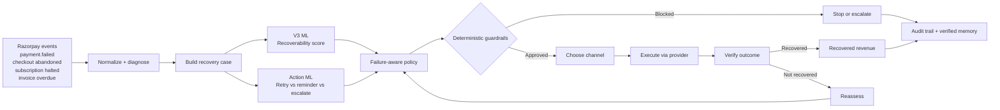
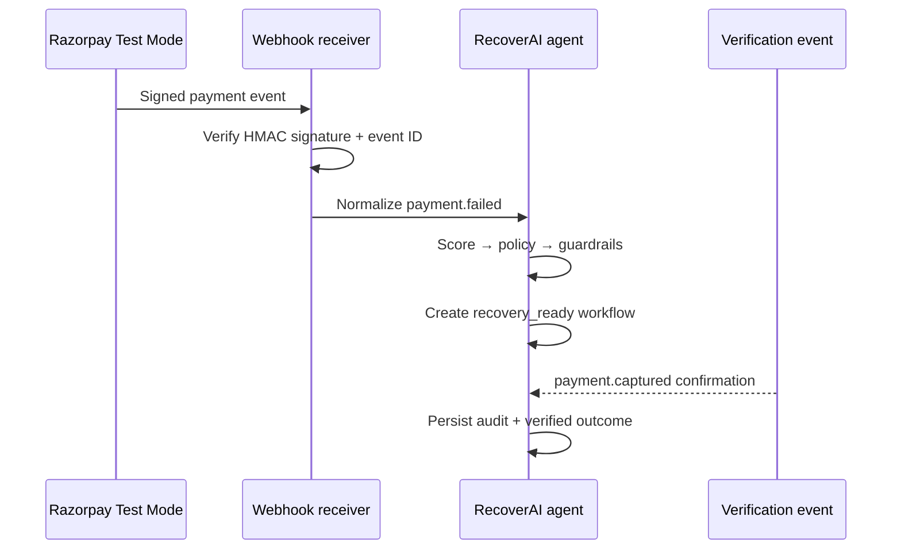

# RecoverAI

**Razorpay Buildathon Track 03 — AI Revenue Recovery**

RecoverAI recovered **51.93% of failed payments** versus **35.84% for a one-retry baseline** — a
**+16.09 percentage-point improvement** — on 3,262 held-out unseen cases, recovering
**₹44,315,137 simulated** versus ₹30,996,494 for the baseline, a difference of **₹13,318,643**.

> These are deterministic simulated benchmark outcomes on an isolated unseen population.
> All customer identities, contact data, and payment records are synthetic. No real customer
> money was moved. Strategy comparisons use the checked-in unseen files and are reproducible.
> Production recovery is confirmed only by captured or paid Razorpay events, never authorization alone.

---

## The Core Idea

A payment failure is not a single problem. Insufficient funds needs a reminder. A timeout needs
a retry. A risk decline must never be retried automatically. An expired instrument needs the
customer to act first. A blocked instrument goes straight to manual review.

RecoverAI diagnoses the failure, selects the safest action from a failure-aware policy, enforces
deterministic guardrails, executes through a provider boundary, and verifies the outcome — all in
a closed loop with a full audit trail.

```
revenue-risk event
  → normalize + diagnose failure
  → build deduplicated recovery case
  → V3 ML recoverability score
  → action-conditioned recommender (retry vs reminder vs escalate)
  → failure-aware policy sequence
  → deterministic guardrails
  → provider execution
  → outcome verification
  → recovered · escalated · stopped
```

**ML recommends. Policy constrains. Guardrails authorize. Provider executes. Event verifies.**

Judge Mode also exposes an explainable AI judgment: recommended action, confidence level,
supporting evidence, blocked candidates, and a counterfactual next step. This judgment is
advisory and cannot authorize an action outside policy or deterministic guardrails.

---

## Measured Result

| Strategy | Recovery rate | Cases recovered | Simulated recovery |
|---|---:|---:|---:|
| RecoverAI | 51.93% | 1,694 | ₹44,315,137 |
| One-retry baseline | 35.84% | 1,169 | ₹30,996,494 |
| Difference | **+16.09 pp** | **+525** | **+₹13,318,643** |

RecoverAI also recorded 4,092 automated attempts, 1,480 safe escalations, and 88 stopped cases.
Every transition has an audit event.

---

## Why Not Just Use an LLM?

Payment recovery requires deterministic safety guarantees. An LLM cannot be trusted to:

- Never retry a risk decline
- Never contact an opted-out customer
- Never exceed the attempt budget
- Never mark a payment recovered without provider confirmation

RecoverAI uses ML where probability estimation adds value and deterministic rules where safety
is non-negotiable. The two layers are explicitly separated and tested independently.

---

## The AI Layer

Two complementary models:

- **V3 recoverability model** (`HistGradientBoosting`, accuracy 0.810, ROC-AUC 0.732, PR-AUC 0.902)
  estimates whether a revenue-risk case is recoverable.
- **Action recommender V2** scores retry, reminder, and escalation for the current case context
  using action-conditioned probability × amount − cost (Expected Recovery Value).

Neither model can override consent, risk policy, retry limits, or merchant guardrails.
The action recommender is a prototype ranking signal trained on the synthetic benchmark.
A production deployment would retrain on verified merchant outcomes.

---

## The Safety Layer

| Failure | First action | Recovery path |
|---|---|---|
| Temporary bank failure | Retry | Retry → reminder → escalate |
| Timeout | Retry | Retry → reminder → escalate |
| Insufficient funds | Reminder | Reminder → retry → escalate |
| Authentication failure | Reminder | Reminder → retry → escalate |
| Risk decline | Escalate | Escalate only — no retry |
| Blocked instrument | Escalate | Escalate only — no retry |
| Expired instrument | Reminder | Reminder → escalate |

Guardrails that cannot be overridden by any model score:

- Customer opted out → reminder blocked
- `risk_decline` or `blocked_instrument` → retry blocked
- Attempt limit reached → automated actions blocked, escalation allowed
- ERV ≤ 0 → automated actions blocked, escalation allowed
- High-value case (≥ ₹50,000) + low confidence (< 0.40) → confidence-gated escalation

---

## Razorpay Integration

Working Test Mode provider boundary with HMAC-SHA256 signature verification, INR amount
validation, consent checks, and event-ID idempotency before any case is created.

Supported events: `payment.failed`, `payment.authorized`, `payment.captured`,
`payment_link.paid`, `payment_link.expired`, `subscription.halted`, `invoice.expired`, `order.paid`.

A `payment.failed` event becomes a `recovery_ready` case with a policy-selected next action.
A `payment.captured` or `payment_link.paid` event becomes a verified `recovered` update, preserving
the original recovery case ID from Payment Link notes. `payment.authorized` remains observed until capture.

---

## System Architecture





---

## Run It Locally

Python 3.11+ recommended. All data, model artifacts, and evaluation outputs are checked in —
the dashboard runs without any external credentials.

```powershell
git clone https://github.com/GHARSHASANDEEP/recoverAI.git
cd recoverAI
python -m venv .venv
.\.venv\Scripts\Activate.ps1
python -m pip install -r requirements.txt
```

```bash
# macOS / Linux
python3 -m venv .venv && source .venv/bin/activate
python -m pip install -r requirements.txt
```

### Run tests

```powershell
.\.venv\Scripts\python.exe -m pytest -q
.\.venv\Scripts\python.exe -m compileall -q app.py src
```

89 tests covering policy, guardrails, state transitions, unseen-data joins, action scoring,
channels, memory, webhook signatures, idempotency, and Razorpay event payloads. 0 failures.

### Run the dashboard

```powershell
.\.venv\Scripts\python.exe -m streamlit run app.py
```

Open `http://localhost:8501`. Start with **Judge Mode** — build any case and watch the full
reasoning chain: diagnosis → ML scoring → policy → guardrail → channel → execution → audit trail.

Try `risk_decline` to see a blocked retry. Try `temporary_bank_failure` to see a successful recovery.

### Regenerate the unseen evaluation

```powershell
.\.venv\Scripts\python.exe -m src.data.unseen_generator
.\.venv\Scripts\python.exe -m src.engine.unseen_case_builder
.\.venv\Scripts\python.exe -m src.engine.unseen_erv_batch
.\.venv\Scripts\python.exe -m src.engine.unseen_decision_batch
.\.venv\Scripts\python.exe -m src.engine.unseen_agent_batch
.\.venv\Scripts\python.exe -m src.engine.unseen_baseline_batch
```

### Razorpay Test Mode integration

The integration has two separate responsibilities:

1. The webhook receiver verifies and records Razorpay events.
2. The provider boundary can create an approved Test Mode payment link.

The webhook receiver does not silently execute payment actions. A payment becomes verified
recovery only after a `payment.captured`, `payment_link.paid`, or `order.paid` event. A
`payment.authorized` event remains observed until capture.

#### 1. Start RecoverAI locally

Use one PowerShell terminal. The secret here must exactly match the secret saved in Razorpay:

```powershell
$env:RAZORPAY_WEBHOOK_SECRET = "YOUR_RAZORPAY_WEBHOOK_SECRET"
$env:RECOVERAI_WEBHOOK_HOST = "127.0.0.1"
$env:RECOVERAI_WEBHOOK_PORT = "8001"
.\run_webhook.ps1 -WebhookSecret $env:RAZORPAY_WEBHOOK_SECRET
```

The receiver exposes:

```text
GET  http://127.0.0.1:8001/          service status and route information
GET  http://127.0.0.1:8001/health    health check
GET  http://127.0.0.1:8001/latest    latest recovered workflow
POST http://127.0.0.1:8001/webhooks/razorpay  signed Razorpay webhook
```

Opening `/webhooks/razorpay` in a browser sends `GET`, but the webhook route requires a
signed `POST`; use `/health` or `/latest` for browser checks.

#### 2. Expose the local receiver

In a second PowerShell terminal:

```powershell
ngrok http 8001
```

Copy the current `https://...ngrok...` forwarding URL. Do not reuse an old URL after restarting
ngrok; free ngrok URLs can change.

#### 3. Configure Razorpay Test Mode

In the Razorpay Dashboard:

1. Switch to **Test Mode**.
2. Open **Settings -> Webhooks**.
3. Edit the existing webhook or create one once. Do not create duplicates for every test.
4. Set the URL to:

```text
https://YOUR_CURRENT_NGROK_URL/webhooks/razorpay
```

5. Set the webhook secret to the same value used by `RAZORPAY_WEBHOOK_SECRET`.
6. Enable `payment.failed`, `payment.authorized`, `payment.captured`, `payment_link.paid`,
   `payment_link.expired`, and `order.paid`.
7. Save the webhook and use Razorpay's test-webhook control if available.

The request path is:

```text
Razorpay Test Mode
  -> public HTTPS ngrok URL
  -> local POST /webhooks/razorpay
  -> HMAC signature verification
  -> event-ID idempotency
  -> event normalization and case correlation
  -> recovery workflow and verified audit record
```

#### 4. Verify a payment event

After a Test Mode payment, check the webhook server terminal for:

```text
POST /webhooks/razorpay HTTP/1.1" 200
```

Then open:

```text
http://127.0.0.1:8001/latest
```

An accepted captured or paid event should show:

```json
{
  "event_type": "payment_captured",
  "status": "recovered",
  "verified": true
}
```

The detailed audit files are:

```text
data/processed/razorpay_webhook_events.jsonl
data/processed/razorpay_recovery_workflow.jsonl
```

#### 5. Troubleshoot common tunnel errors

`ERR_NGROK_334` means the requested ngrok endpoint is already online or conflicts with an
existing tunnel. Stop the old ngrok terminal before starting another one, or keep the existing
tunnel and use the forwarding URL it already displays. Then update Razorpay if the URL changed.

If events return HTTP `400`, compare the Razorpay webhook secret with the secret in the running
receiver. If events never arrive, confirm that ngrok is running, the URL contains
`/webhooks/razorpay`, and the Razorpay webhook is in Test Mode. Test payments do not move real
money; they only generate provider events and test-state transitions.

---

## Repository Map

| Path | Contents |
|---|---|
| `app.py` | Streamlit dashboard — hero KPIs, Judge Mode, baseline comparison, audit timeline |
| `src/engine/` | Normalization, case building, policy, guardrails, ERV, agent, batch evaluation |
| `src/model/` | V3 training, V2 action recommender, confidence scoring, recovery memory |
| `src/integrations/` | Razorpay webhook receiver, event normalization, provider boundary |
| `src/data/` | Generators, taxonomy, outcome simulator |
| `tests/` | 89 regression tests |
| `models/` | Trained artifacts + V3 evaluation report |
| `data/unseen/processed/` | Held-out evaluation outputs |

---

## Learning Boundary

`src/model/recovery_memory.py` accepts only explicitly verified provider outcomes.
Simulator results are never silently written as merchant feedback.
A production deployment would retrain the action recommender on verified merchant outcomes.

---

## Project Status

Working Track 03 prototype. Reproducible unseen benchmark. Test Mode Razorpay webhook receiver.
Policy-controlled agent. 89 passing tests. 0 compile errors.

Does not claim simulated benchmark money is real revenue or that Test Mode is production processing.
